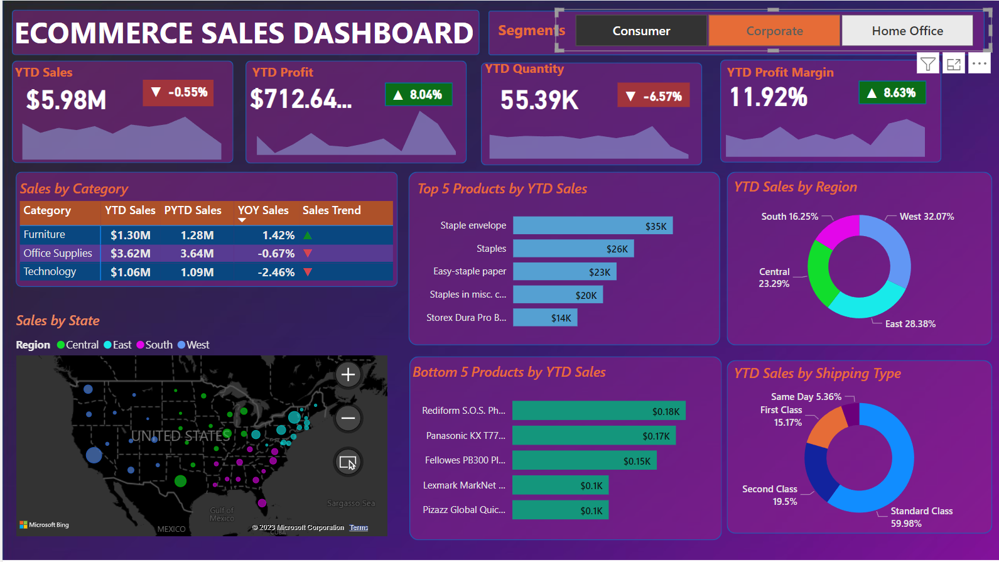

# ECommerce-Sales-Dashboard

## Description
     The US based ECommerce Sales Company wants us to create a Sales Dashboard showing information of YTD (Year to Date) Sales and generate various insights under different scenarios given in the problem Statement. The data set is obtained from the Kaggle website.

## Problem Statement
1. Create KPI Banner showing YTD Sales, YTD Profit, YTD Quantity sold, YTD Profit Margin
2. Find Year on Year growth (YOY) for each KPI and show a YTD sparkline for each measure in the KPI to understand the monthly trend for each fact.
3. Find YTD Sales,PYTD Sales,YOY Sales growth for different customer category.Add a trend icon for each category.
4. Find YTD Sales performance by each State.
5. Find Top 5 and bottom 5 Products by Sales.
6. Find YTD Sales by Region to know best and worst performing region all over country.
7. Find YTD Sales by Shipping Type to get the best shipping type percentage.

## Tools Used
- Microsoft Excel 2019 
- POWER BI

## Steps in the Project
- Import Excel files, "ecommerce_data.csv" and "us_state_long_lat_codes.csv" into PowerBI
- Data Cleaning
- Data Processing
- Creating Datetable
- Data Modelling
- Using TIME Inteligence Function and DAX CAlculation Various Parameters such as  YTD Sales,YTD Profit,YTD Quantity sold,YTD Profit Margin,YOY Sales are Calculated.
- Data Visualisation
- Creating Dashboard
- Generating Insights such as  performance by each State Top and Bottom 5 Products by Sales,YTD Sales by Region ,YTD Sales by Shipping

 ## Formulas Used
- Year to Date (YTD) Sales=Sum of total sales per order for the current year
- Previous Year to Date(PYTD) Sales=Sum of total sales per order for the previous year
- Year On Year (YOY) Sales= (YTD Sales-PYTD Sales)/PYTD Sales
- Year to Date (YTD) Profit=-Sum of total profit per order for the current year
- Previous Year to Date(PYTD) Profit=Sum of total profit per order for the previous year
- Year On Year (YOY) Profit= (YTD Profit-PYTD Profit)/PYTD Profit
- Year to Date (YTD) Quantity sold=-Sum of total Quantity sold per order for the current year
- Previous Year to Date(PYTD) Quantity sold=Sum of total  Quantity sold per order for the previous year
- Year On Year (YOY) Quantity sold= (YTD  Quantity sold-PYTD  Quantity sold)/PYTD  Quantity sold
- Profit Margin= Sum of Profit per order/Sum of total sales per order
- YTD Profit Margin= Total Profit Margin for the Current year
- Previous Year to Date (PYTD) Profit Margin= Total Profit Margin for the previous year
- YOY Profit Margin=(YTD Profit Margin- (PYTD) Profit Margin)/ (PYTD) Profit Margin

 ## Summary of Findings
 The Power BI dashboard for ECommerce Sales Analysis  is created in an interactive way where the required parameters in Sales Data can be viewed on a wider angle based on different segments,product categories,sales by State,by shipping methods,and sales by Region.

